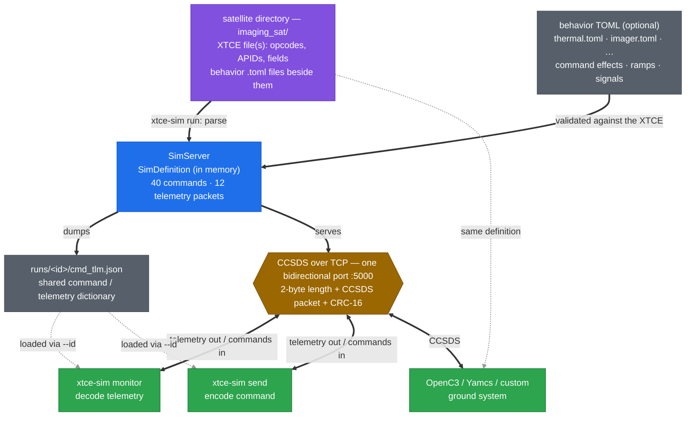

# xtce-sim

**Run a CCSDS satellite simulator straight from an XTCE file.**

```bash
xtce-sim run examples/imaging_sat/imaging_sat.xml --id sat-a --port 5000
```

`xtce-sim` parses an [XTCE](https://www.omg.org/spec/XTCE/) command/telemetry
definition, builds the commands and telemetry **in memory**, and starts a CCSDS
packet simulator on a TCP port. Point anything at it — OpenC3, Yamcs, a custom
client, or the bundled `xtce-sim monitor`. An optional
[behavior sidecar](#behavior-making-commands-change-telemetry) makes the
simulated vehicle *act*: commands change telemetry, heaters warm toward their
setpoints, panels ride the orbit thermal cycle.

No OpenC3 required, no heavyweight ground system — just a small Python
package with a light dependency footprint (`click`, `crcmod`, and `aiohttp`
for the bundled single-page [web console](#web-console)).

## How it fits together

XTCE is the contract. `xtce-sim run` parses it into an in-memory definition,
writes a machine-readable copy to `<satellite dir>/runs/<id>/cmd_tlm.json`, and serves CCSDS on a
single bidirectional TCP port — telemetry frames stream out, command frames come
in, each a length-prefixed CCSDS packet with a CRC.



*(Thick solid arrows: build + the live CCSDS link. Thin gray dashed arrows: the
command/telemetry definition, shared out-of-band — no in-band discovery.)*

The wire carries only binary CCSDS — there is **no in-band discovery**. A client
learns the command/telemetry set *out of band*: the bundled `monitor` and `send`
load the `cmd_tlm.json` the server dumped (via `--id`), and a third-party ground
system (OpenC3, Yamcs, your own) is configured with the same XTCE. Either way,
both ends derive identical opcodes, APIDs, and field layouts from one definition.
(One packet rides outside the XTCE: the command echo on reserved APID 0x7FD —
link protocol, not payload telemetry; a third-party ground system can simply
ignore that APID. See the web console section.)

## Commands

```bash
xtce-sim inspect  <file.xml...>                    # narrate what the parser sees and infers
xtce-sim generate <file.xml...>                    # build defs, write cmd/tlm to disk, stop
xtce-sim run      <file.xml...> --id ID --port N   # build, dump, and serve
xtce-sim monitor  --id ID --port N                 # watch decoded live telemetry
xtce-sim ui       --id ID --port N                 # live browser console (WebSocket push)
xtce-sim send     --id ID --port N CMD K=V ...     # send a command
xtce-sim upload   <file> --id ID --port N          # upload a file to the vehicle's store
xtce-sim exercise --id ID --port N                 # send every command, check telemetry health
xtce-sim seq check <file.ats|.rts> --def <xml>     # validate a command sequence file
xtce-sim seq shift <file.ats> --start-in 30s       # re-base an ATS to start soon
```

### Example

```bash
# Terminal 1 — serve the bundled example satellite
xtce-sim run examples/imaging_sat/imaging_sat.xml --id sat-a --port 5000 --live

# Terminal 2 — watch telemetry stream in, decoded by field name
xtce-sim monitor --id sat-a --port 5000

# Terminal 3 — send a command (enum arguments accept their labels)
xtce-sim send --id sat-a --port 5000 SET_POWER SubsystemId=3 PowerState=ON
```

The bundled example is
[`examples/imaging_sat/`](examples/imaging_sat) — an Earth-observation
satellite with imaging, thermal, a full ADCS (attitude determination and
control: quaternion attitude, four-wheel pyramid, star tracker/sun/mag
sensors — raw counts with calibrators throughout), file transfer, and
ATS/RTS sequencing. The per-subsystem behavior files beside its XTCE are
discovered automatically, so its commands actually change its telemetry and
its ADCS flies real physics from the first beacon — see
[Behavior](#behavior-making-commands-change-telemetry) and
[Physics models](#physics-models-the-adcs-flies) below.

Command and telemetry can live in **one** XTCE file (as above) or in
**several** — pass them all and they are merged, since some vendors ship
command and telemetry databases separately:

```bash
xtce-sim run sat_commands.xml sat_telemetry.xml --id sat-a --port 5000
```

### Inspecting a definition

Before serving a new XTCE, ask the parser to narrate what it sees — and, more
importantly, what it *infers*:

```bash
xtce-sim inspect examples/imaging_sat/imaging_sat.xml
```

```text
parsing examples/imaging_sat/imaging_sat.xml (SpaceSystem 'ImagingSat')
resolved inheritance: 41 command(s) with a base command (41 fixing inherited args via assignments), ...
significance: 11 command(s) declare non-normal criticality (2 vital, 9 critical)
~ aggregate 'ADCS_ATT_QUAT' flattened to 4 field(s) (ADCS_ATT_QUAT_Q1...)
...
built ImagingSat: 40 dispatchable command(s), 12 telemetry packet(s)

Behavior (examples/imaging_sat):
  initial values: 5 field(s)
    ...
  boot signals: 8
    THM_PANEL_PLUS_X oscillates (sine) around 10.0 amplitude 25.0, period 5400.0s ±noise(0.5)
    ...
  HEATER_ON:
    THM_HEATER{HeaterId}_STATE = 'ON'  [emit: immediate]
    THM_HEATER{HeaterId}_TEMP ramps to @THM_HEATER{HeaterId}_SETPOINT (tau=30.0s)
  ...
OK: ImagingSat — 40 command(s), 12 packet(s)
```

Lines marked `~` are **inferences and gaps** — places the parser filled a gap
rather than reading an explicit declaration (an enum sized from its max value,
a boolean defaulted to 1 bit, a command assigned a synthetic opcode), and
**content the parser ignored**: after the parse it reports any element the
file declared but nothing ever read (`ignored N <VerifierSet> ... — present
in the XTCE but not read by this parser`), so unsupported XTCE features are
visible instead of silently dropped. (The shipped examples currently contain
no unread elements — a test pins that.) Warnings appear inline with a `!` marker. `inspect --full`
traces every parsed element, and `inspect --dump` appends the complete
resolved inventory — every command and telemetry packet, the same report
`generate` writes to `<satellite dir>/runs/<id>/cmd_tlm.txt`. The same trace is available
live during a build or serve with `generate -v` / `run -v` (`-vv` for the
full firehose). `inspect` writes nothing to disk.

### Command significance

XTCE lets a definition declare how dangerous each command is —
`<DefaultSignificance consequenceLevel="critical" reasonForWarning="..."/>`,
with the levels (`normal`, `vital`, `critical`, `forbidden`, `user1`)
following ISO 14950 telecommand criticality. The imaging satellite declares
eleven hazardous commands (wheel shutdowns, desaturation, sequence starts,
file deletion), and the significance follows the command everywhere an
operator meets it:

```
$ xtce-sim send --def examples/imaging_sat/imaging_sat.xml --port 5000 ADCS_DESATURATE
ADCS_DESATURATE is CRITICAL: Attitude transients while momentum unloads; imaging unavailable
sent ADCS_DESATURATE (0x48) args={}
```

`exercise --dry-run` badges hazardous commands, the dumped `cmd_tlm.txt`
marks them (`[CRITICAL]` with the declared reason), derived commands inherit
their base command's significance up the XTCE inheritance chain, and the web
console's command log wears a red or amber badge on each hazardous entry
(hover for the reason). This is display only, deliberately: a real arm/fire
confirmation gate is future work, and would be designed for scripts, not
sprung on them.

### Argument range enforcement

Declared `ValidRange`s (and enum membership) are enforced on **both ends of
the link**, the way real systems do it. The ground refuses to build an
invalid command — nothing is transmitted:

```
$ xtce-sim send --def examples/imaging_sat/imaging_sat.xml --port 5000 ADCS_WHEEL_SET_SPEED WheelId=7 Speed=0
ADCS_WHEEL_SET_SPEED is VITAL: Bypasses the controller; test mode only
Error: ADCS_WHEEL_SET_SPEED: WheelId=7 is outside ValidRange [1.0, 4.0]
```

And the vehicle validates for itself — it does not trust the ground. A
command that arrives out of range anyway (a foreign client, a corrupted
uplink, a truncated payload whose zero-padding falls outside a declared
range) is **rejected**: no effects apply, the sim logs why, and the command
echo carries the `rejected` status, so the web console's command log shows
a red `✗ rejected` entry the moment it happens. To exercise that path
deliberately, `send --force` skips the ground-side check and transmits
anyway — the honest way to test flight software's own guards:

```
$ xtce-sim send --def examples/imaging_sat/imaging_sat.xml --port 5000 --force ADCS_WHEEL_SET_SPEED WheelId=7 Speed=0
ADCS_WHEEL_SET_SPEED is VITAL: Bypasses the controller; test mode only
--force: skipping ground-side range checks
sent ADCS_WHEEL_SET_SPEED (0x47) args={'WheelId': '7', 'Speed': '0'}
```

Bounds are inclusive, and float32 arguments are compared as the wire sees
them (value and bounds quantized identically on both ends, so a legal
boundary value can never be accepted by the ground and rejected by the
vehicle). Two scope notes: XTCE's *exclusive* min/max attributes parse but
are not yet enforced; and command arguments carry no calibrators in this
pipeline, so declared ranges apply directly to the value you type (which
*is* the wire value) — XTCE's raw-vs-calibrated range distinction becomes
relevant only if argument calibration lands later.

### Exercising the command surface

Smoke-test every command a definition declares — one send per enum label and
per numeric min/max boundary — then confirm telemetry is still flowing and
decodable:

```bash
xtce-sim exercise --id sat-a --port 5000
```

```text
Exercising 40 command(s) on 127.0.0.1:5000 ...
Commands: sent 82/82 OK
Telemetry: 35 packet(s), 12 APID(s), 0 decode failure(s)
  sample: ADCS_STATUS: ADCS_TIMESTAMP=0, ADCS_MODE=3, ADCS_EST_STATE=0
```

`--command NAME` limits the sweep (repeatable), `--dry-run` prints what would
be sent without connecting, and the exit code is non-zero on any failure — 
usable in CI.

At full speed the sweep finishes in well under a second — fine for CI,
useless to watch. For a human at a monitor or the web console, slow it down
and let it run:

```bash
xtce-sim exercise --id sat-a --port 5000 --pause 1 --loop
```

`--pause 1` waits a second after each send and narrates every send as it
happens (`ADCS_SET_MODE  Mode=NADIR  ok`), so you can match commands to the
telemetry reacting; `--loop` repeats the whole sweep until Ctrl-C, reporting
the sweep count on exit.

`--reject-probes N` mixes N deliberately out-of-range sends into the sweep —
a valid command with exactly one argument pushed past its declared range or
enum, transmitted with the ground check bypassed, so the vehicle's own
rejection path gets exercised alongside the happy path. Placement is
seeded-deterministic (each `--loop` pass sprinkles differently, but the same
run reproduces exactly), `--dry-run` marks them `[REJECT-PROBE]`, and in the
web console each one lands as a red `✗ rejected` line in the command log.

The imaging satellite also ships a scripted sweep,
[`examples/imaging_sat/set_all_fields.sh`](examples/imaging_sat/set_all_fields.sh),
which sets every command-settable telemetry field to a distinctive value one
send at a time — heater setpoints, exposure, quaternion, wheel speeds — a
guided tour of the behavior wiring rather than a boundary probe (a test
cross-validates every line of it against the XTCE).

### Monitor styles

`monitor` has three display styles (`--style`). Output is colored in a real
terminal; the values below are illustrative (serve with `--live` or a behavior
sidecar for moving data — with neither, the beacon is zeros).

**`compact`** (default) — one line per packet; scrolls, greps, pipes. Shows the
first few fields; add `--fields` for all.

```
07:25:25.338  0x10 HOUSEKEEPING     seq 0      TIMESTAMP=1735689604 s  SYSTEM_MODE=STANDBY  CMD_RECV_COUNT=8  CMD_REJECT_COUNT=8  +10 more
07:25:25.339  0x11 IMAGER_STATUS    seq 0      TIMESTAMP=1735689604 s  STATE=IDLE  EXPOSURE_MS=75  GAIN=75  +6 more
07:25:25.339  0x12 POWER_STATUS     seq 0      TIMESTAMP=1735689604 s  SOLAR_VOLTAGE=16.014 V  SOLAR_CURRENT=0.968 A  BATTERY_VOLTAGE=23.864 V  +7 more
```

**`table`** — a boxed, per-packet table of every field with value and unit. On
a terminal it repaints in place without flicker; piped, tables append so the
output stays greppable. Best paired with `--packet NAME` to focus one packet
(unfiltered, each arriving packet repaints over the last).

```
┌ HOUSEKEEPING · APID 0x10 · seq 1 · 07:25:26.340
│ HK_TIMESTAMP            1735689605  s
│ HK_SYSTEM_MODE          STANDBY
│ HK_CMD_RECV_COUNT       10
│ HK_CMD_REJECT_COUNT     10
│ HK_LAST_CMD_OPCODE      80
│ HK_UPTIME               10
│ HK_ERROR_COUNT          10
│ HK_BUS_VOLTAGE          7.536  V
│ HK_BUS_CURRENT          0.99  A
│ HK_BATTERY_SOC          80
│ HK_BOARD_TEMP           22.99  degC
│ HK_ISSUED_TIMESTAMP     1.73569e+09  s
│ HK_RECEIVED_TIMESTAMP   1.73569e+09  s
│ HK_GENERATED_TIMESTAMP  1.73569e+09  s
└─────────────────────────────────────────────────
```

*(every field in the packet — all 14 of HOUSEKEEPING's, here in full)*

**`dashboard`** — a full-screen view, one row per APID, refreshing in place.

```
xtce-sim monitor · sat-a · 127.0.0.1:5000     packets 11
──────────────────────────────────────────────────────────────────
0x10 HOUSEKEEPING   seq 0      TIMESTAMP=1735689605 s  SYSTEM_MODE=STANDBY  CMD_RECV_COUNT=10  CMD_REJECT_COUNT=10  LAST_CMD_OPCODE=80  +9
0x11 IMAGER_STATUS  seq 0      TIMESTAMP=1735689605 s  STATE=IDLE  EXPOSURE_MS=80  GAIN=80  BAND1_AVG=79.6482  +5
0x12 POWER_STATUS   seq 0      TIMESTAMP=1735689605 s  SOLAR_VOLTAGE=16.171 V  SOLAR_CURRENT=0.99 A  BATTERY_VOLTAGE=24.178 V  BATTERY_CURRENT=0.99 A  +6
0x13 THERMAL_STATUS seq 0      TIMESTAMP=1735689605 s  PANEL_PLUS_X=9.81 degC  PANEL_MINUS_X=10.18 degC  PANEL_PLUS_Y=35.33 degC  PANEL_MINUS_Y=-14.55 degC  +7
0x14 EVENT_LOG      seq 0      TIMESTAMP=1735689605 s  SEVERITY=1  SUBSYSTEM=80  EVENT_ID=80  MESSAGE=
0x16 ATS_STATUS     seq 0      TIMESTAMP=1735689605 s  SEQ_ID=10  SEQ_NAME=  STATE=LOADED  CMD_TOTAL=10  +5
0x17 RTS_STATUS     seq 0      TIMESTAMP=1735689605 s  SEQ_ID=10  SEQ_NAME=  STATE=LOADED  CMD_TOTAL=10  +5
0x18 ADCS_STATUS    seq 0      TIMESTAMP=1735689605 s  MODE=STANDBY  EST_STATE=CONVERGING  POINTING_ERR=0 deg  MOMENTUM_TOTAL=0 Nms  +3
0x19 ADCS_ATTITUDE  seq 0      ATT_TIMESTAMP=1735689605 s  ATT_QUAT_Q1=-9.15555e-05  ATT_QUAT_Q2=3.05185e-05  ATT_QUAT_Q3=3.05185e-05  ATT_QUAT_Q4=1  +6
0x1A ADCS_WHEELS    seq 0      WHL_TIMESTAMP=1735689605 s  WHEEL1_SPEED=0 RPM  WHEEL2_SPEED=0 RPM  WHEEL3_SPEED=0 RPM  WHEEL4_SPEED=0 RPM  +8
0x1B ADCS_SENSORS   seq 0      SNS_TIMESTAMP=1735689605 s  ST_QUAT_Q1=-9.15555e-05  ST_QUAT_Q2=3.05185e-05  ST_QUAT_Q3=3.05185e-05  ST_QUAT_Q4=1  +8
```

*(the instance label is the `--id`. `0x15 FILE_RECEIPT` is absent by design:
file receipts are event telemetry — they downlink when a transfer or a
FILE_\* command happens, and never on the beacon.)*

Filter to specific packets with `--packet NAME` (repeatable).

### Web console

`xtce-sim ui` serves a live browser console — every packet, every field, in
one window, updated the instant data arrives:

```bash
xtce-sim ui --def examples/imaging_sat/imaging_sat.xml --port 5000
# Console: http://127.0.0.1:8080/  (sim 127.0.0.1:5000, Ctrl-C to stop)
```

The layering is deliberate. The sim server plays the *spacecraft*: it speaks
only framed CCSDS over TCP and never learns about JSON or browsers. `ui` is a
separate small process playing the *ground station* — it connects to the
sim's TCP port exactly like `monitor` does, decodes each packet against the
definition, and pushes JSON to the browser over WebSocket. On connect the
browser receives the full definition (packets, fields, units, enum labels)
and builds its panels from it — the page hardcodes nothing.

In the console: one panel per packet with every field, values in engineering
units with an **EU/RAW** toggle (same rules as `monitor --raw`), a changed
value breathes briefly, panels dim when their packets stop arriving, and a
link dot tracks the sim connection — kill the sim and it goes red, restart
and the bridge reconnects on its own. Because telemetry is *pushed*,
immediate emissions (see below) appear the moment they happen, between
beacon beats. `--http-port` moves the console off 8080; commanding from the
browser is planned, not yet built.

**The command log.** The console is split in two — a command history and
the telemetry grid — separated by a draggable splitter bar (the header's
*split* button flips it between horizontal and vertical; your arrangement
and position are remembered). Every command the sim processes while the
console is open appears in the log as it executes: timestamp, name, every
argument (enums as their labels), and a status mark — green ✓ for executed,
red ✗ tagged with the failure status (`rejected`, `unknown_opcode`,
`failed`) for one that wasn't. Hazardous commands (see [Command
significance](#command-significance)) wear a red (`critical`/`forbidden`) or
amber (`vital`) badge; hovering it shows the declared reason. The log holds
the last 500 entries and sticks to the bottom unless you've scrolled up to
read history.

The command log works the way real ground systems learn about commanding:
the vehicle reports it. On every command it processes — from any client,
`send`, the exerciser, anyone — the sim broadcasts a **command echo**: a
telemetry packet on a reserved APID (0x7FD, documented in `ccsds.py`)
carrying the original command bytes verbatim plus an execution status. The
bridge decodes the embedded command against the definition to recover the
name and arguments. Real systems verify commanding with the same family of
mechanisms (command counters, ECSS PUS Service 1 acknowledgment, literal
command echo); this is the echo flavor. The echo APID is part of this
simulator's link protocol — like the length-prefix framing — not part of
any satellite's XTCE, and the terminal `monitor` skips it (the web console
is its renderer).

### Live telemetry

Telemetry values come from up to three layers. With no options the sim beacons
zeros for every field no behavior file claims (the bundled satellite carries
behavior files that fly its ADCS fields from boot, options or not). Add
`--live` to `run` and it beacons changing synthetic values instead —
counters climb, temperatures and voltages drift, wheel speeds wobble — so
`monitor` shows moving data:

```bash
xtce-sim run examples/imaging_sat/imaging_sat.xml --id sat-a --port 5000 --live
```

```
07:28:40.080  0x10 HOUSEKEEPING     seq 0      TIMESTAMP=1735689604 s  SYSTEM_MODE=STANDBY  CMD_RECV_COUNT=8  CMD_REJECT_COUNT=8  +10 more
07:28:41.081  0x10 HOUSEKEEPING     seq 1      TIMESTAMP=1735689605 s  SYSTEM_MODE=STANDBY  CMD_RECV_COUNT=10  CMD_REJECT_COUNT=10  +10 more
```

`--live` heuristics choose plausible engineering values ("about 8 volts") — a
light stand-in, not physics. A field whose XTCE declares a calibrator
transmits the raw count that decodes back to that value, so the wire stays
honest. The third layer is the
[behavior sidecar](#behavior-making-commands-change-telemetry): any field it
governs overrides both other layers, so seeded values, command effects, and
ambient signals always win over zeros and `--live` synthetics.

When the XTCE declares calibrators (polynomial or spline), the wire always
carries raw counts and `monitor` converts them, showing engineering units by
default; pass `--raw` to see the counts as transmitted.

Every `run` and `generate` writes the resolved command/telemetry to the
satellite's own directory, `<satellite dir>/runs/<id>/`
(`cmd_tlm.txt` for humans, `cmd_tlm.json` for machines; add `--emit-py` for an
importable Python snapshot). The `monitor` and `send` clients load that
`cmd_tlm.json` via `--id`, so they need no XTCE of their own (use `--def <file>`
to point at a specific `.json` or `.xml`).

### Fleets

Run several instances at once — replicas of one satellite or entirely different
ones — each its own process with its own `--id` and `--port`:

```bash
xtce-sim run examples/imaging_sat/imaging_sat.xml --id sat-a --port 5001 &
xtce-sim run examples/imaging_sat/imaging_sat.xml --id sat-b --port 5002 &
xtce-sim run other_sat.xml  --id probe --port 5003 &
```

Each instance keys a stable color off its `--id`, so when their logs share a
terminal the `[id]` tags stay easy to tell apart (a given id is always the same
color). Control it with `--color auto|always|never`.

Try it with the bundled example satellite — three replicas in one terminal:

```bash
V=examples/imaging_sat/imaging_sat.xml
xtce-sim run $V --id sat-a --port 5001 --color always &
xtce-sim run $V --id sat-b --port 5002 --color always &
xtce-sim run $V --id sat-c --port 5003 --color always &
```

You'll see three colored `listening on …` lines. Send a different command to
each and watch it appear in that instance's color:

```bash
xtce-sim send --id sat-a --port 5001 SET_POWER SubsystemId=1 PowerState=ON
xtce-sim send --id sat-b --port 5002 TAKE_IMAGE ImageCount=3
xtce-sim send --id sat-c --port 5003 RESET SubsystemId=2 ResetMode=HARD
```

```
07:03:30 [sat-a] listening on 127.0.0.1:5001 — 40 command(s), 12 packet(s)
07:03:30 [sat-b] listening on 127.0.0.1:5002 — 40 command(s), 12 packet(s)
07:03:34 [sat-a] command 0x10 SET_POWER args={'SubsystemId': 1, 'PowerState': 'ON'}
07:03:35 [sat-b] command 0x33 TAKE_IMAGE args={'ImageCount': 3}
```

Watch one instance's telemetry live, then stop the fleet:

```bash
xtce-sim monitor --id sat-b --port 5002 --style dashboard
kill $(jobs -p)          # or: pkill -f "xtce-sim run"
```

## Behavior: making commands change telemetry

The XTCE defines the *interface* — packets, fields, commands, encodings.
**Behavior TOML files** define what the vehicle *does*: what each command
changes, and how values evolve on their own. A satellite is a directory: the
XTCE and its per-subsystem behavior files (`thermal.toml`, `imager.toml`, ...)
live together, every `.toml` beside the XTCE is auto-discovered and merged —
strictly, so the same field in the same table in two files is a load error
naming both files (`--behavior <dir-or-file>` overrides discovery). Behavior
is kept out of the XTCE on purpose — no standard XTCE construct expresses
behavior, and the same interface files work unmodified in OpenC3/Yamcs.

```toml
[_initial]                       # seeded once at boot
THM_HEATER1_SETPOINT = 40.0

[HEATER_ON]                      # effects applied when HEATER_ON executes
"THM_HEATER{HeaterId}_STATE" = { set = "ON", emit = "immediate" }
"THM_HEATER{HeaterId}_TEMP" = { ramp_to = "@THM_HEATER{HeaterId}_SETPOINT", tau = 30.0 }

[SET_HEATER_SETPOINT]
"THM_HEATER{HeaterId}_SETPOINT" = "@arg:Setpoint"

[_signals]                       # ambient behaviors running from boot
THM_PANEL_PLUS_X = { oscillate = 10.0, amplitude = 25.0, period = 5400, noise = 0.5 }
PWR_BATTERY_VOLTAGE = { hold = 24.0, noise = 0.3 }
```

That is a working thermal subsystem: `HEATER_ON HeaterId=1` flips the state
enum (acknowledged instantly — see below) and starts the temperature on a
first-order exponential toward the setpoint. Change the setpoint mid-climb and
the ramp bends toward it live, because `@FIELD` targets are re-read every tick.
Meanwhile the panel rides a 90-minute orbit sine and the battery bus jitters
around 24 V, no commands required.

**The verbs.** A bare scalar sets a field when the command executes;
`"@arg:Name"` copies a command argument (enum labels arrive as labels, stored
as raw values); `{ increment = n }` adds. Three verbs are *continuous* —
registered per field and advanced by the beacon clock: `ramp_to`/`tau`
(first-order approach, dt-independent), `oscillate` with `amplitude`, `period`
(seconds — always periods, never Hz), optional `shape` (`sine`, `triangle`,
`sawtooth`) and `phase`, and `hold` (keeps re-asserting a value or tracking an
`@FIELD`). The continuous verbs compose with `noise = stddev` — Gaussian
jitter with one seeded RNG per field, so runs reproduce exactly. One behavior
per field: a new command's behavior replaces the old (HEATER_OFF's cooling
displaces HEATER_ON's warming), and a direct set cancels it — last command
wins. `{ArgName}` templates in field names scale one rule across HeaterId 1
and 2; an `@FIELD` reference may not name its own field (feeding a field its
own output is drift, not jitter).

**Values are engineering units.** A calibrated field transmits raw counts on
the wire, but behavior values mean what they say — `ramp_to = 40.0` on a
temperature is forty degrees, and the engine converts to counts at the wire
boundary (and back, for live `@FIELD` references). Command a setpoint of
25.304 and the readback shows 25.30: the round trip through integer counts
quantizes, exactly like real telemetry.

**Validation is strict and total.** Every field name, argument reference, enum
label, verb, and attribute is checked against the XTCE at load, and *all*
problems are reported in one error — a broken sidecar blocks startup rather
than misbehaving quietly. At runtime the engine is deliberately liberal: a
skipped effect logs a warning and the beacon keeps flowing.

### Immediate emission

By default a command's effects ride the next beacon. Mark an instant effect
(`set`/copy/`increment`) with `emit = "immediate"` and the packet containing
that field is emitted the moment the command executes — an *extra*
transmission, sequence counters continuous, beacon schedule untouched. This is
the standard command-acknowledgment / event-report pattern (PUS services 1
and 5): the ground learns the vehicle obeyed *now*. Several immediate fields
in one packet emit it once; continuous verbs reject the flag at load.

The imaging satellite uses it to turn EVENT_LOG into a real event channel:

```toml
[TAKE_IMAGE]
IMG_STATE = { set = "CAPTURING", emit = "immediate" }
EVT_MESSAGE = { set = "IMAGE CAPTURE STARTED", emit = "immediate" }
EVT_EVENT_ID = { set = 11, emit = "immediate" }
```

See it: serve with a slow beacon so the instant packets stand out, watch, and
command —

```bash
xtce-sim run examples/imaging_sat/imaging_sat.xml --port 5000 --interval 10
xtce-sim monitor --def examples/imaging_sat/imaging_sat.xml --port 5000
xtce-sim send --def examples/imaging_sat/imaging_sat.xml --port 5000 TAKE_IMAGE ImageCount=3
```

IMAGER_STATUS (`STATE=CAPTURING`) and EVENT_LOG (`EVENT_ID=11`) appear alone,
out of rhythm, the instant the command lands — the rest of the telemetry
arrives on the ten-second beat. `xtce-sim inspect` narrates a loaded sidecar
(initial values, boot signals, per-command effects, `[emit: immediate]`
marks), so you can review the behavior without running anything.

### Physics models: the ADCS flies

Some subsystems are too coupled for per-field verbs: an attitude slew is not
a value changing, it is a rigid body rotating because reaction wheels torqued
it. The `[_models]` construct hands a whole slice of the telemetry space to a
physics model. The imaging satellite's `adcs.toml` declares one:

```toml
[_models.adcs]
kind = "adcs"
substep = 0.1                # s of physics per RK4 step

[_models.adcs.body]
inertia = [12.0, 14.0, 9.0]  # kg*m^2

[[_models.adcs.wheels]]      # x4: the reaction wheel pyramid
axis = [0.6, 0.0, 0.8]
inertia = 0.02
max_torque = 0.05
max_speed = 600.0

[_models.adcs.orbit]
altitude_km = 500.0
inclination_deg = 51.6

[_models.adcs.outputs]       # model outputs -> XTCE fields, explicitly
ADCS_MODE = "mode"
ADCS_ATT_QUAT_Q1 = "quat_q1"
# ... 41 bindings in the shipped file
```

Behind those bindings runs owned, dependency-free physics: Euler's rigid-body
equation with wheel momentum exchange integrated by RK4, a quaternion-feedback
PD controller, a circular orbit with sun, eclipse, and a rotating tilted-dipole
magnetic field, and modeled sensors (star tracker with a sun-exclusion cone,
gyro with bias, sun sensor, magnetometer) feeding an estimator. **The control
loop closes on the estimates, and the telemetry reports them** — command a
bogus gyro bias and the vehicle genuinely settles off-target by the closed-form
amount an ADCS engineer would predict.

The ADCS commands are inputs to the model, not table entries:
`ADCS_SLEW_TO_QUATERNION` starts a real slew that converges over tens of
seconds through saturated wheel torques (watch `ADCS_POINTING_ERR` fall in the
web console); `ADCS_SET_MODE Mode=NADIR` tracks the LVLH frame around the
orbit; `Mode=DETUMBLE` runs a filtered B-dot law through the magnetorquers,
exactly as slowly as the real technique; `ADCS_DESATURATE` dumps wheel
momentum through the magnetorquers while the hold loop keeps pointing —
`ADCS_MOMENTUM_TOTAL` drains on live telemetry. Wheel currents follow
delivered motor torque; speeds read back in RPM, rates in deg/s, the field in
µT — the XTCE's units, converted from the model's SI internals.

Nothing about the model is specific to this satellite. A second vehicle —
kept as a test fixture rather than an example
([`tests/data/my_vehicle/`](tests/data/my_vehicle)) — flies the same model as
a **three-wheel** variant whose ICD is a deliberate subset: three orthogonal
wheels instead of the four-wheel pyramid, six of the eleven command roles,
fewer telemetry fields, and a mode enumeration without TARGET_TRACK (whose
STANDBY is a different raw value). Validation checks the mode binding against
the modes *that vehicle can actually reach* through its wired commands, so a
leaner ICD is a correct configuration, not an error. That fixture is how the
suite proves the engine is driven by the XTCE rather than built around any one
satellite.

Ownership is validated at load: a field bound under `[outputs]` belongs to
the model, and any `[_initial]` seed or command-table effect that targets it
is a load error naming the model — one source of truth per field. All
simplifications (circular unperturbed orbit, fixed inertial sun, cylindrical
shadow, centered dipole, quasi-static wheel temperatures) are documented in
the module docstrings rather than hidden.

## Development

```bash
uv run pytest                             # run the test suite
uv run pytest --cov=xtce_sim              # with coverage (gate: fail_under=90%)
uv run ruff check xtce_sim                # lint
```

The fleet and logging behavior has direct coverage:

```bash
uv run pytest tests/test_logs.py tests/test_server.py -v
```

- `test_instance_color_is_deterministic` — an `--id` always maps to the same color
- `test_colors_spread_across_whole_palette` — ids exercise every palette color
- `test_two_instances_serve_independently` — two servers on separate ports, each
  serving its own client

Continuous integration ([`.github/workflows/ci.yml`](.github/workflows/ci.yml)) runs
lint + tests + the coverage gate on Python 3.11–3.13, and a
[SonarQube Cloud](docs/sonarcloud.md) scan.

Confirm the color mapping directly (`sat-a` is the same color both times):

```bash
uv run python -c "from xtce_sim import logs; \
[print(f'{i:6} -> {logs.instance_color(i)}') for i in ['sat-a','sat-b','sat-c','sat-a']]"
```

## Status

Early development.

## License

MIT — see [LICENSE](LICENSE).
