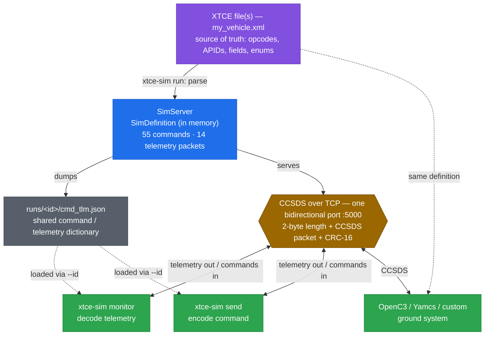

# xtce-sim

**Run a CCSDS satellite simulator straight from an XTCE file.**

```bash
xtce-sim run my_vehicle.xml --id sat-a --port 5000
```

`xtce-sim` parses an [XTCE](https://www.omg.org/spec/XTCE/) command/telemetry
definition, builds the commands and telemetry **in memory**, and starts a CCSDS
packet simulator on a TCP port. Point anything at it — OpenC3, Yamcs, a custom
client, or the bundled `xtce-sim monitor`.

No OpenC3 required. No web UI. Just a small Python package with a tiny
dependency footprint (only `click` and `crcmod`).

## How it fits together

XTCE is the contract. `xtce-sim run` parses it into an in-memory definition,
writes a machine-readable copy to `runs/<id>/cmd_tlm.json`, and serves CCSDS on a
single bidirectional TCP port — telemetry frames stream out, command frames come
in, each a length-prefixed CCSDS packet with a CRC.



*(Solid arrows: build + the live CCSDS link. Dashed arrows: the command/telemetry
definition, shared out-of-band — no in-band discovery.)*

The wire carries only binary CCSDS — there is **no in-band discovery**. A client
learns the command/telemetry set *out of band*: the bundled `monitor` and `send`
load the `cmd_tlm.json` the server dumped (via `--id`), and a third-party ground
system (OpenC3, Yamcs, your own) is configured with the same XTCE. Either way,
both ends derive identical opcodes, APIDs, and field layouts from one definition.

## Commands

```bash
xtce-sim inspect  <file.xml...>                    # narrate what the parser sees and infers
xtce-sim generate <file.xml...>                    # build defs, write cmd/tlm to disk, stop
xtce-sim run      <file.xml...> --id ID --port N   # build, dump, and serve
xtce-sim monitor  --id ID --port N                 # watch decoded live telemetry
xtce-sim send     --id ID --port N CMD K=V ...     # send a command
xtce-sim exercise --id ID --port N                 # send every command, check telemetry health
```

### Example

```bash
# Terminal 1 — serve the bundled example satellite
xtce-sim run examples/my_vehicle.xml --id sat-a --port 5000 --live

# Terminal 2 — watch telemetry stream in, decoded by field name
xtce-sim monitor --id sat-a --port 5000

# Terminal 3 — send a command (enum arguments accept their labels)
xtce-sim send --id sat-a --port 5000 SET_POWER SubsystemId=3 PowerState=ON
```

Command and telemetry can live in **one** XTCE file (as above) or in **several**
— pass them all and they are merged. The same satellite is also provided split
into separate files, which load exactly the same way:

```bash
xtce-sim run examples/my_vehicle_commands.xml examples/my_vehicle_telemetry.xml \
  --id sat-a --port 5000
```

A second, richer example ships as
[`examples/imaging_sat.xml`](examples/imaging_sat.xml) — an Earth-observation
satellite with imaging, thermal, file-transfer, and ATS/RTS sequencing.

### Inspecting a definition

Before serving a new XTCE, ask the parser to narrate what it sees — and, more
importantly, what it *infers*:

```bash
xtce-sim inspect examples/imaging_sat.xml
```

```text
parsing examples/imaging_sat.xml (SpaceSystem 'ImagingSat')
resolved inheritance: 31 command(s) with a base command (31 fixing inherited args via assignments), ...
~ ignored 9 <DefaultSignificance> element(s) (e.g. under MetaCommand 'NOOP') — present in the XTCE but not read by this parser
built ImagingSat: 30 dispatchable command(s), 8 telemetry packet(s)

Behavior (examples/imaging_sat.behavior.toml):
  initial values: 5 field(s)
  boot signals: 8
    THM_PANEL_PLUS_X oscillates (sine) around 10.0 amplitude 25.0, period 5400.0s ±noise(0.5)
    ...
  HEATER_ON:
    THM_HEATER{HeaterId}_STATE = 'ON'
    THM_HEATER{HeaterId}_TEMP ramps to @THM_HEATER{HeaterId}_SETPOINT (tau=30.0s)
...
OK: ImagingSat — 30 command(s), 8 packet(s)
```

Lines marked `~` are **inferences and gaps** — places the parser filled a gap
rather than reading an explicit declaration (an enum sized from its max value,
a boolean defaulted to 1 bit, a command assigned a synthetic opcode), and
**content the parser ignored**: after the parse it reports any element the
file declared but nothing ever read (`ignored 1 <SplineCalibrator> ... — not
read by this parser`), so unsupported XTCE features are visible instead of
silently dropped. Warnings appear inline with a `!` marker. `inspect --full`
traces every parsed element, and `inspect --dump` appends the complete
resolved inventory — every command and telemetry packet, the same report
`generate` writes to `runs/<id>/cmd_tlm.txt`. The same trace is available
live during a build or serve with `generate -v` / `run -v` (`-vv` for the
full firehose). `inspect` writes nothing to disk.

### Exercising the command surface

Smoke-test every command a definition declares — one send per enum label and
per numeric min/max boundary — then confirm telemetry is still flowing and
decodable:

```bash
xtce-sim exercise --id sat-a --port 5000
```

```text
Exercising 55 command(s) on 127.0.0.1:5000 ...
Commands: sent 142/142 OK
Telemetry: 14 packet(s), 14 APID(s), 0 decode failure(s)
```

`--command NAME` limits the sweep (repeatable), `--dry-run` prints what would
be sent without connecting, and the exit code is non-zero on any failure — 
usable in CI.

### Monitor styles

`monitor` has three display styles (`--style`). Output is colored in a real
terminal; the values below are illustrative (run with `--live` for moving data —
the default beacons zeros).

**`compact`** (default) — one line per packet; scrolls, greps, pipes. Shows the
first few fields; add `--fields` for all.

```
14:22:01.334  0x01 HOUSEKEEPING   seq 42   TIMESTAMP=1735689600 s  SYSTEM_STATUS=1  COLLECTION_MODE=1  CMD_RECV_COUNT=137  +19 more
14:22:01.334  0x02 EVENTS         seq 42   TIMESTAMP=1735689600 s  SEVERITY=1  EVENT_ID=16  MESSAGE=''
14:22:01.334  0x03 SCIENCE        seq 42   TIMESTAMP=1735689600 s  SEQUENCE_NUM=512  CHANNEL_1=512  CHANNEL_2=512  +3 more
```

**`table`** — a boxed, per-packet table of every field with value and unit. Best
paired with `--packet NAME` to focus one packet.

```
┌ HOUSEKEEPING · APID 0x01 · seq 42 · 14:22:01.334
│ HK_TIMESTAMP         1735689600  s
│ HK_BATTERY_VOLTAGE   7.42        V
│ HK_SOLAR_CURRENT     0.85        A
│ HK_TEMP_BOARD        23.5        degC
│ … 19 more fields
└─────────────────────────────────────────────────
```

**`dashboard`** — a full-screen view, one row per APID, refreshing in place.

```
xtce-sim monitor · sat-a · 127.0.0.1:5000     packets 1,284
──────────────────────────────────────────────────────────
0x01 HOUSEKEEPING   seq 42   TIMESTAMP=1735689600 s  SYSTEM_STATUS=1  COLLECTION_MODE=1  CMD_RECV_COUNT=137  +19
0x02 EVENTS         seq 42   TIMESTAMP=1735689600 s  SEVERITY=1  EVENT_ID=16  MESSAGE=''
0x03 SCIENCE        seq 42   TIMESTAMP=1735689600 s  SEQUENCE_NUM=512  CHANNEL_1=512  CHANNEL_2=512  +3
```

Filter to specific packets with `--packet NAME` (repeatable).

### Live telemetry

By default the sim beacons zeros. Add `--live` to `run` and it beacons changing
synthetic values instead — counters climb, temperatures and voltages drift,
wheel speeds wobble — so `monitor` shows moving data:

```bash
xtce-sim run my_vehicle.xml --id sat-a --port 5000 --live
```

```
0x01 HOUSEKEEPING  seq 6  TIMESTAMP=1735689603 s  CMD_RECV_COUNT=6  UPTIME=6  WHEEL_SPEED_1=1573 RPM
0x01 HOUSEKEEPING  seq 7  TIMESTAMP=1735689604 s  CMD_RECV_COUNT=7  UPTIME=7  WHEEL_SPEED_1=1585 RPM
0x01 HOUSEKEEPING  seq 8  TIMESTAMP=1735689604 s  CMD_RECV_COUNT=8  UPTIME=8  WHEEL_SPEED_1=1596 RPM
```

Values are the raw wire values (uncalibrated), chosen by field-name heuristics —
a light stand-in, not XTCE-driven physics. Calibrated fields therefore read as
raw counts rather than engineering units.

Every `run` and `generate` writes the resolved command/telemetry to `runs/<id>/`
(`cmd_tlm.txt` for humans, `cmd_tlm.json` for machines; add `--emit-py` for an
importable Python snapshot). The `monitor` and `send` clients load that
`cmd_tlm.json` via `--id`, so they need no XTCE of their own (use `--def <file>`
to point at a specific `.json` or `.xml`).

### Fleets

Run several instances at once — replicas of one satellite or entirely different
ones — each its own process with its own `--id` and `--port`:

```bash
xtce-sim run my_vehicle.xml --id sat-a --port 5001 &
xtce-sim run my_vehicle.xml --id sat-b --port 5002 &
xtce-sim run other_sat.xml  --id probe --port 5003 &
```

Each instance keys a stable color off its `--id`, so when their logs share a
terminal the `[id]` tags stay easy to tell apart (a given id is always the same
color). Control it with `--color auto|always|never`.

Try it with the bundled example satellite — three replicas in one terminal:

```bash
V=examples/my_vehicle.xml
xtce-sim run $V --id sat-a --port 5001 --color always &
xtce-sim run $V --id sat-b --port 5002 --color always &
xtce-sim run $V --id sat-c --port 5003 --color always &
```

You'll see three colored `listening on …` lines. Send a different command to
each and watch it appear in that instance's color:

```bash
xtce-sim send --id sat-a --port 5001 SET_POWER SubsystemId=1 PowerState=ON
xtce-sim send --id sat-b --port 5002 START_COLLECTION Mode=BURST Duration=3600
xtce-sim send --id sat-c --port 5003 RESET SubsystemId=2 ResetType=HARD
```

```
08:49:01 [sat-a] listening on 127.0.0.1:5001 — 55 command(s), 14 packet(s)
08:49:01 [sat-b] listening on 127.0.0.1:5002 — 55 command(s), 14 packet(s)
08:49:04 [sat-a] command 0x10 SET_POWER args={'SubsystemId': 1, 'PowerState': 'ON'}
08:49:05 [sat-b] command 0x20 START_COLLECTION args={'Mode': 'BURST', 'Duration': 3600}
```

Watch one instance's telemetry live, then stop the fleet:

```bash
xtce-sim monitor --id sat-b --port 5002 --style dashboard
kill $(jobs -p)          # or: pkill -f "xtce-sim run"
```

## Development

```bash
uv run pytest                             # run the test suite
uv run pytest --cov=xtce_sim              # with coverage (gate: fail_under=90%)
uv run ruff check xtce_sim                # lint
```

The fleet and logging behavior has direct coverage:

```bash
uv run pytest tests/test_logs.py tests/test_server.py -v
```

- `test_instance_color_is_deterministic` — an `--id` always maps to the same color
- `test_colors_spread_across_whole_palette` — ids exercise every palette color
- `test_two_instances_serve_independently` — two servers on separate ports, each
  serving its own client

Continuous integration ([`.github/workflows/ci.yml`](.github/workflows/ci.yml)) runs
lint + tests + the coverage gate on Python 3.11–3.13, and a
[SonarQube Cloud](docs/sonarcloud.md) scan.

Confirm the color mapping directly (`sat-a` is the same color both times):

```bash
uv run python -c "from xtce_sim import logs; \
[print(f'{i:6} -> {logs.instance_color(i)}') for i in ['sat-a','sat-b','sat-c','sat-a']]"
```

## Status

Early development.

## License

MIT — see [LICENSE](LICENSE).
