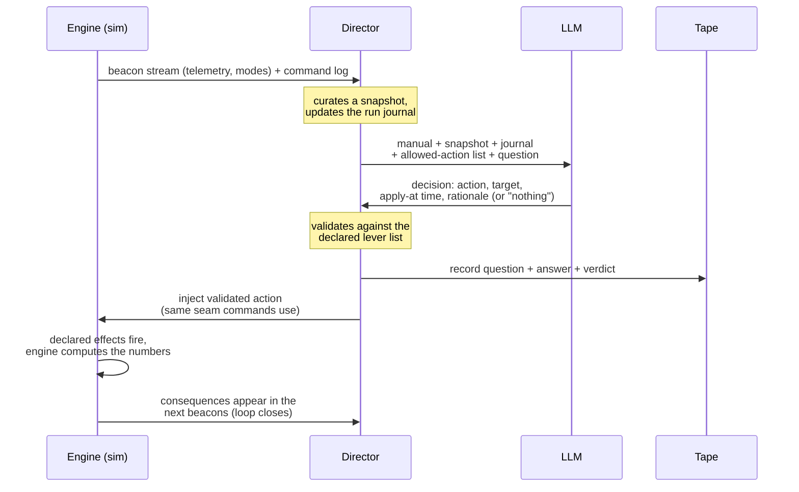

# The agent director — design discussion

**Status: design discussion only. Nothing in this document is implemented.**
This captures the 2026-07-21 conversation about letting the sim use an
LLM (large language model) for some of its inputs, so the reasoning
survives until we decide whether to build it.

## What we ruled out first

The obvious version — asking a model "battery was at 82%, the imager just
turned on, what is the battery at now?" — was considered and rejected.
Language models do not conserve energy, do not integrate differential
equations reliably, and do not give the same answer twice. Putting one in
the tick loop would replace physics we own with plausible-sounding
numbers, break the determinism our tests depend on, and be orders of
magnitude too slow. **For continuous telemetry, the engine keeps the math.**

What survives is a division of labor:

> The agent decides *what happens*; the engine decides *what the numbers do*.

The LLM operates at the slow, discrete layer — mode transitions, fault
cascades, "the wheel has been running hot for an hour, what degrades?" —
where its qualitative breadth is the asset and its arithmetic never touches
the telemetry.

## The two honesty rules

**Rule one — the agent only pulls declared levers.** The agent never writes
telemetry values. It makes qualitative decisions ("wheel 2 has degraded —
put it in the FRICTION_HIGH condition"), and that decision is injected
through the same declared-behavior machinery a command uses: a declared
effect fires, and the engine computes every number on every tick
afterward. The LLM contributes judgment, never arithmetic.

**Rule two — every decision goes on tape.** LLMs are not deterministic, and
our whole methodology is. So every consultation is recorded: at this sim
time, the agent was asked this, and answered that. A run can then be
replayed from the tape with the LLM unplugged — perfectly deterministic,
no network, no API key. Live mode is for exercises, where surprise is the
point; replay mode is for regression tests and for re-running a good
scenario for the next trainee.

## The cast

| Actor | What it is | What it knows |
|---|---|---|
| **Engine** | The sim as it exists today | Nothing new — it emits beacons and accepts injections through its ordinary seam |
| **Director** | A new, ordinary program (no intelligence in it) — the adapter between sim and model | The manual, the beacon stream, the run journal, the allowed-action list |
| **LLM** | The model, consulted at decision points | Only what the director puts in each prompt — it is stateless |
| **Tape** | The recorded journal of the run | Every question, answer, and validation verdict, timestamped in sim time |

The operator and their ground tools are unchanged and do not know this
layer exists.

## What the LLM is given (the three inputs)

The model gets what a human subsystem expert behind the console would have:

1. **The manual** — a standing description of the vehicle, prepared before
   any run: the wiring model (see `power-wiring-model.md`, which is page
   one of it), the subsystems and their modes, and the list of levers the
   agent is allowed to pull. The quality ceiling of the whole idea is set
   by the manual, not by the model.
2. **The console** — a snapshot of recent telemetry in engineering units
   plus recently received commands, taken from the same beacon stream every
   ground client reads. No internal sim state, no raw counts.
3. **The log** — the run journal: summarized events so far, including the
   agent's own earlier decisions. Without it each consultation is an
   amnesiac; with it the run is a coherent story that can escalate,
   relent, or cascade.

## One decision cycle — who says what to whom

Walking the arrows:

- **The engine speaks first, but not specially.** It emits beacons on the
  socket as always. The director connects as a client, the way `monitor`
  does; the engine cannot tell it from any other ground tool.
- **The director listens and curates.** It keeps a rolling picture of the
  vehicle and maintains the journal — summarized events, not raw
  telemetry. At each decision point it assembles the prompt from the four
  ingredients: manual, snapshot, journal, allowed-action list.
- **The LLM receives everything and remembers nothing.** All memory lives
  in the journal, replayed into every prompt. That makes the model
  swappable, the prompts inspectable, and a run reconstructible — no
  hidden state the tape doesn't capture. It answers a narrow question:
  which of these actions, if any, and when, and why — structured, not
  prose.
- **The director treats the answer with suspicion.** It validates the
  action against the lever list and argument ranges, exactly as the engine
  validates a command against the XTCE (XML Telemetric and Command
  Exchange) interface definition. A malformed or off-menu answer
  gets one retry, then becomes "nothing happened" — the agent can be
  wrong, but it cannot be wrong *into the sim*. Question, answer, and
  verdict go on the tape before anything else happens.
- **The engine cannot tell who sent the injection.** Director-triggered
  events and command-triggered events arrive through the same seam and
  fire the same declared machinery. This is the invariant that keeps rule
  one honest.
- **The loop closes by itself.** Consequences appear in the next beacons;
  the operator reacts; the director sees both in its stream; everything
  lands in the journal; the next consultation is asked against the new
  reality.

## The one engine-side addition: declared scenario levers

The design needs fault conditions that exist as declared behaviors but are
not reachable by ordinary vehicle commands — a wheel-friction ramp, a
cell-imbalance mode — the director's private menu, written in the sidecar
TOML alongside everything else. This is a modest extension of the behavior
grammar we already have, and it is useful with no LLM at all: a human
exercise designer could script the same levers by hand.

## Timing and failure

The director asks about the future, not the present — "do you act in the
next interval?" — so a few seconds of model latency never stalls anything.
The engine never blocks on the director. If the model times out or the
network is down, the director records "no decision" and the sim keeps
flying: the agent layer degrades to nothing, not to a hang.

Decision points can be periodic (once a minute of sim time is plenty for
fault-injection drama, and keeps cost trivial) or event-driven (consult on
notable events — a command arrives, a threshold crosses, an eclipse
starts). Both fit the record/replay rule equally well.

## Replay mode

Replay is the same director with the LLM unplugged: it reads the tape and
injects each recorded, already-validated action at its recorded sim time.
Everything downstream — engine, effects, numbers — is untouched and
deterministic. This is the mode the regression tests run.

## Related ideas parked in the same conversation

- **Agent as author**: describe the vehicle in English and have a model
  emit the declarative artifacts the engine already runs (XTCE, sidecar
  behavior, sequences, topology). Needs zero sim changes; the strongest
  near-term fit.
- **Agent as operator**: an agent connected to the socket as a ground
  station, flying scenarios and responding to anomalies. Also zero sim
  changes; the cheapest experiment to run.
- **Prerequisite for all versions**: the vehicle wiring must exist as a
  declared, deterministic artifact before any agent can be told about it.
  `power-wiring-model.md` is the first piece of that.
