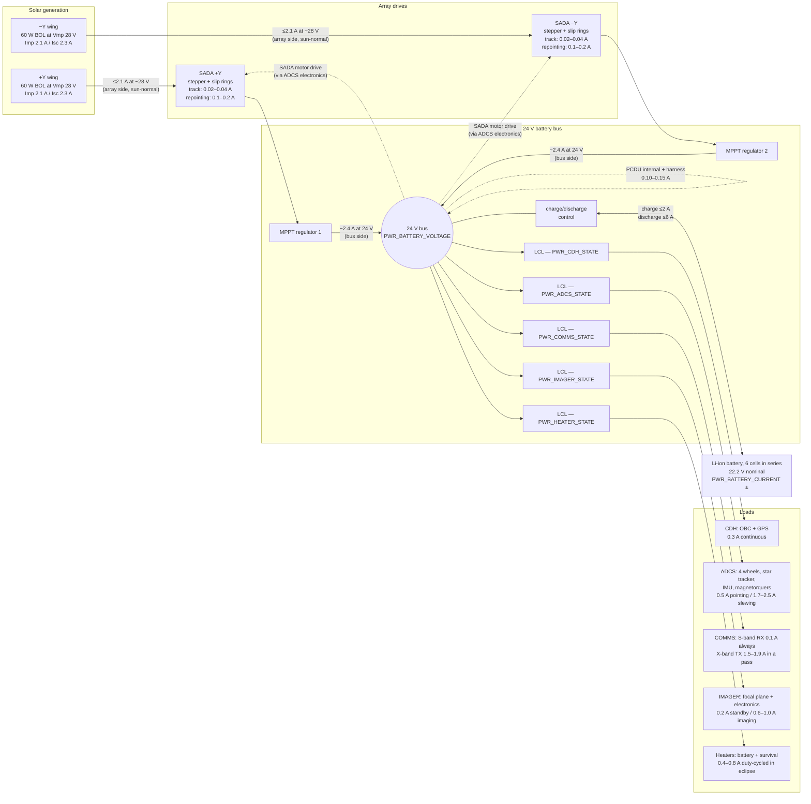
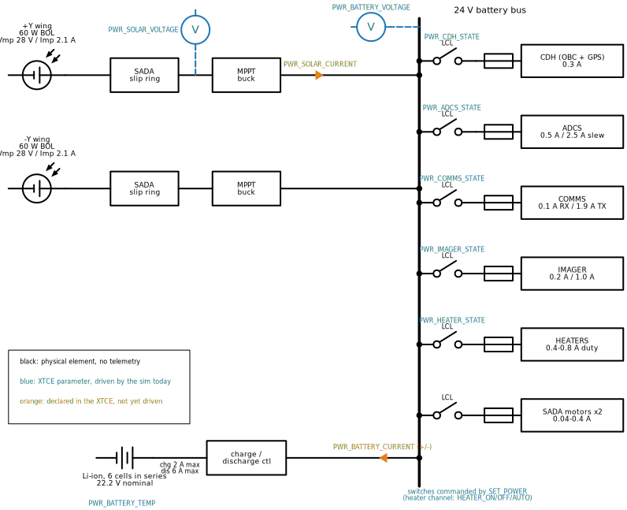

# Power wiring model — a reference electrical power system (EPS) for an imaging microsat

This document is a reference model of how electrical power moves through a
spacecraft of the class the `imaging_sat` example represents: a roughly
100 kg-class Earth-imaging microsatellite with articulated solar wings.
The numbers are honest ranges drawn from vendor datasheets and the smallsat
literature (sources at the bottom), not measurements of one specific
vehicle — treat each figure as a calibration knob, not a constant.

Two things anchor the model to the simulator as it exists today:

- The example vehicle runs a **24 V battery bus** with five switched load
  channels — `PWR_CDH_STATE`, `PWR_ADCS_STATE`, `PWR_COMMS_STATE`,
  `PWR_IMAGER_STATE`, `PWR_HEATER_STATE` — declared in the XTCE (XML
  Telemetric and Command Exchange) interface definition and driven
  by `examples/imaging_sat/power.toml`.
- All four analog senses — `PWR_SOLAR_VOLTAGE`, `PWR_SOLAR_CURRENT`,
  `PWR_BATTERY_VOLTAGE`, `PWR_BATTERY_CURRENT` — are now DRIVEN by the
  `[_models.power]` physics model this document specified (see "Status in
  the sim" below for exactly what is implemented and what waits for the
  downlink arc).

## Architecture

The topology is the standard one for this vehicle class. Solar wings feed
through solar array drive assemblies (SADAs — single-axis rotary drives
with slip rings, so the wings can rotate continuously while power and
telemetry pass through). Raw array power enters maximum-power-point-tracking
(MPPT) regulators inside a Power Conditioning and Distribution Unit (PCDU).
The PCDU maintains an unregulated battery bus — a 6-cell lithium-ion
(Li-ion) string, 22.2 V nominal, which reads near 24 V through most of the charge range
(the example boots at exactly that: `initial_soc = 0.75` is 24.0 V
open-circuit) — and
distributes power through switched, current-limited outputs (latching
current limiters, LCLs), one per load. The `PWR_*_STATE` switches in the
example are exactly those LCLs.

In real designs the command-and-data-handling computer (CDH — also called
the on-board computer, OBC) and the PCDU's own controller sit on an
*essential* (unswitchable) bus so the spacecraft cannot turn off its own
brain; the sim models CDH as switchable like the rest, which is a known
simplification.

Abbreviations that appear in the diagram before their sections: BOL is
beginning of life (the array's day-one output, before degradation); the
array symbols Vmp/Imp/Isc are defined in the electrical-characteristics
table below; IMU is the inertial measurement unit; RX/TX are the radio
receiver and transmitter.

## One-line electrical diagram

The same system drawn as an electrical one-line schematic — each LCL
drawn as its switch and current limit (shown as a fuse), the battery
behind its charge/discharge control, and the array chains through the
slip rings and MPPT stages onto the bus bar — with the **logical layer
overlaid in color** on the physical circuit, mapping each XTCE parameter
onto the element that would physically produce it. Blue marks parameters
the sim drives — since power-model bank one that is all of them: both
voltmeter sense points, both current senses, the five switch-state enums,
and the battery temperature. Black elements with no colored tag have no
telemetry in the ICD at all: the charge controller and the SADA motor
branch are honest blind spots, visible as such.

The diagram is generated by `power_one_line.py` (requires `schemdraw`,
deliberately not a project dependency — install it anywhere and rerun the
script from this directory when the diagram changes).

## Solar array electrical characteristics

Each wing is a deployable panel of triple-junction cells, strung so its
maximum-power point sits *above* the battery bus — the MPPT regulators
buck array voltage down to the bus, which only works with headroom to
spare. Per wing:

The subscripts follow photovoltaic convention: *mp* is the maximum-power
point (the voltage/current pairing where the panel delivers its most
power), *oc* is open-circuit, *sc* is short-circuit.

| Quantity | Value | Meaning |
|---|---|---|
| Pmp (BOL) | 60 W | Maximum power at beginning of life (BOL), sun-normal |
| Pmp (EOL) | ~50 W | Maximum power at end of life (EOL): after radiation/thermal-cycle degradation (~3%/yr, 5-yr design life) |
| Vmp | ~28 V | Voltage at the maximum-power point (temperature-dependent: rises cold, sags hot) |
| Imp | ~2.1 A | Current at the maximum-power point |
| Voc | ~33 V | Open-circuit voltage (the unloaded panel, e.g. just out of eclipse) |
| Isc | ~2.3 A | Short-circuit current — the array's hard current ceiling |

Two things the model derives from these. **Bus-side yield:** 60 W through
a ~95% efficient MPPT is ~57 W onto the 24 V bus, i.e. ~2.4 A per wing,
~4.7 A total sun-normal — the "generation ~5 A" the repointing section
starts from. **Off-pointing:** array current scales with the cosine of the
off-sun angle (voltage holds near Vmp until the angle gets extreme), so
`PWR_SOLAR_CURRENT` is ~`2 × Imp × cos(θ)` at the array, and the bus
contribution follows.

These figures are now the sim's actual configuration: `[_models.power]`
in `power.toml` carries them, `PWR_SOLAR_VOLTAGE` reads Vmp in sunlight
and ~0 in eclipse, and `PWR_SOLAR_CURRENT` is the cosine curve above,
computed from the vehicle's real attitude against the shared
`[_environment]` sun.

## Typical current draws (at the 24 V bus)

| Module | Quiescent / standby | Nominal operation | Peak | Notes |
|---|---|---|---|---|
| CDH (OBC + GPS) | — (always on) | 0.3 A (~8 W) | 0.4 A | Small OBCs run ~1.3 W; microsat-class units with GPS sit near 8 W. Rides the essential bus in real designs. |
| ADCS suite | 0.15 A | 0.5 A (~12 W) pointing | 1.7–2.5 A slewing | Wheels dominate: ~2 W quiescent each, but tens of watts at torque (e.g. Honeywell HR04: 2 W quiescent, 48 W peak). Star tracker ~1 W. |
| COMMS | 0.1 A (S-band RX, ~2 W) | 0.35 A (RX + S-band beacon TX ~0.25 A, ~6 W) | 1.5–1.9 A (X-band TX) | The receiver never turns off. The low-rate S-band beacon (≤2 W RF) transmits whenever beacon mode is enabled. A downlink with 5–10 W of radio-frequency (RF) output costs 35–45 W of direct-current (DC) input at realistic amplifier efficiency, for the ~10 minutes of a ground pass. |
| IMAGER | 0.2 A standby | 0.6–1.0 A imaging | 1.0 A | Focal-plane electronics plus thermal stabilization during a capture window. |
| HEATER circuit | 0 | 0.4–0.8 A duty-cycled | 0.8 A (~20 W) | Battery heater ~8 W plus survival heaters; mostly an eclipse load, thermostatically switched. |
| SADA motors (×2) | ~0 holding (<1 mW) | 0.02–0.04 A each, sun-tracking steps | 0.1–0.2 A each, repointing | Steppers barely sip while tracking (~0.5 W); continuous stepping during a large repoint costs a few watts per wing. |
| PCDU internal + harness | 0.10–0.15 A | 0.10–0.15 A | — | Conversion losses and bus-monitoring overhead. |

Summing the columns: quiet sunlit cruise is about **1.1 A (~26 W)**; a full
imaging pass — slewing to target, capturing, then downlinking — stacks up
to **4–6.5 A (~100–160 W)**, which is why the battery matters even in
full sunlight.

## The repointing transient

"Solar panels repointing" is a *double* hit on the power system, and the
SADA motor current is the trivial half of it.

When the spacecraft slews to point the imager at a ground target, the wings
are dragged off-sun with the body. Generation falls with the cosine of the
off-sun angle and can drop from ~5 A to under 1 A. The SADAs then step
continuously to recover sun on the wings — adding their 0.2–0.4 A of motor
draw — while the reaction wheels are simultaneously pulling their ~2 A slew
current. For that minute or two the bus load roughly triples at the same
moment generation collapses, and `PWR_BATTERY_CURRENT` swings hard negative
(discharge) even in sunlight. After the maneuver the charge controller
pushes ~2 A back into the battery until it recovers.

That generation-versus-attitude coupling is the interesting cross-subsystem
wiring: solar current is a function of ADCS attitude, battery current is
generation minus the sum of the switched loads, and the load sum is a
function of what the vehicle is *doing*.

## Status in the sim

Bank one of this model is IMPLEMENTED (`[_models.power]` in
`examples/imaging_sat/power.toml`, physics in `xtce_sim/dynamics/power.py`):

- Solar current follows the shared `[_environment]` sun and eclipse plus
  the vehicle's real attitude — the cosine law above, with perfect
  single-axis SADA tracking as the documented simplification. Solar
  voltage reads Vmp in sunlight, ~0 in shadow.
- The battery is real state: charge integrates every tick, terminal
  voltage follows charge (linear open-circuit curve, a documented
  approximation) and sags under load through the string resistance; the
  charge controller tapers over the top 10% of charge and shunts surplus.
  `PWR_BATTERY_CURRENT` is signed: positive charging, negative
  discharging.
- Each load's draw follows what the vehicle is *doing* (bank two), gated
  by its `PWR_*_STATE` LCL: CDH is flat; the ADCS load is its electronics
  plus the live wheel currents the dynamics model computes (the same amps
  `ADCS_WHEELS` telemeters, so a slew genuinely triples the draw); the
  imager's draw is keyed on `IMG_STATE` (idle keep-alive, capture,
  processing); COMMS is the always-on receiver, plus beacon transmit while
  `COMM_BEACON_STATE` reads ENABLE, plus the 1.6 A X-band transmitter
  while `COMM_DOWNLINK_STATE` reads ACTIVE (DOWNLINK_START/STOP are real
  session commands now — the biggest switch on the bus, from this
  document's repointing-transient analysis); and each heater element draws when
  forced ON or, in AUTO, exactly while its thermostat's regulate loop has
  the element lit — the thermostat's duty sawtooth appears directly in
  `PWR_BATTERY_CURRENT`.
- Two honest limits, recorded rather than hidden: pulling an LCL only
  stops the *draw* — it does not halt the subsystem behind it (the ADCS
  keeps flying with its power "off"; LCL feedback into the models is
  future work), and the SADA motor draw remains unmodeled (a blind spot
  the schematic shows in black).

Still ahead: the data products themselves — an active session currently
carries idle frames (as a real transmitter with an empty queue does)
until the playback unit gives it stored products to stream — and thermal
coupling (battery temperature is still a behavioral hold).

## Sources

- [Power Electronics News — electrical power architecture of CubeSats and SmallSats](https://www.powerelectronicsnews.com/electrical-power-architecture-of-cubesats-and-smallsats/)
- [MDPI Aerospace — COTS-based power conditioning and distribution unit for small satellites](https://www.mdpi.com/2226-4310/13/4/364)
- [Honeybee Robotics — SmallSat SADA datasheet](https://d1o72l87sylvqg.cloudfront.net/blue-origin/HBR_SmallSat_SADA_PDT.pdf)
- [ESMATS — development of a solar array drive assembly for CubeSat](https://www.esmats.eu/amspapers/pastpapers/pdfs/2010/passaretti.pdf)
- [Moog — small satellite SADA datasheet](https://www.moog.com/content/dam/moog/literature/sdg/space/spacecraft-mechanisms/moog-small-sat-solar-array-drive-assembly-datasheet.pdf)
- [AAC Clyde Space — iADCS400](https://www.aac-clyde.space/what-we-do/space-products-components/adcs/iadcs400)
- [Honeywell — HR04 reaction wheel datasheet](https://satcatalog.s3.amazonaws.com/components/226/SatCatalog_-_Honeywell_-_HR04_RWA_-_Datasheet.pdf?lastmod=20210708034038)
- [NewSpace Systems — reaction wheel datasheet](https://www.newspacesystems.com/wp-content/uploads/2024/02/Reaction-Wheel-Datasheet-A4.pdf)
- [satsearch — X-band transmitters on the global marketplace](https://blog.satsearch.co/2020-02-27-an-overview-of-satellite-x-band-transmitters-available-on-the-global-marketplace)
- [EnduroSat — S-band receiver datasheet](https://satcatalog.s3.amazonaws.com/components/1045/SatCatalog_-_EnduroSat_-_S-Band_Receiver_-_Datasheet.pdf?lastmod=20210715011936)
- [satsearch — on-board computers on the global marketplace](https://blog.satsearch.co/2020-03-11-an-overview-of-on-board-computer-obc-systems-available-on-the-global-space-marketplace)
